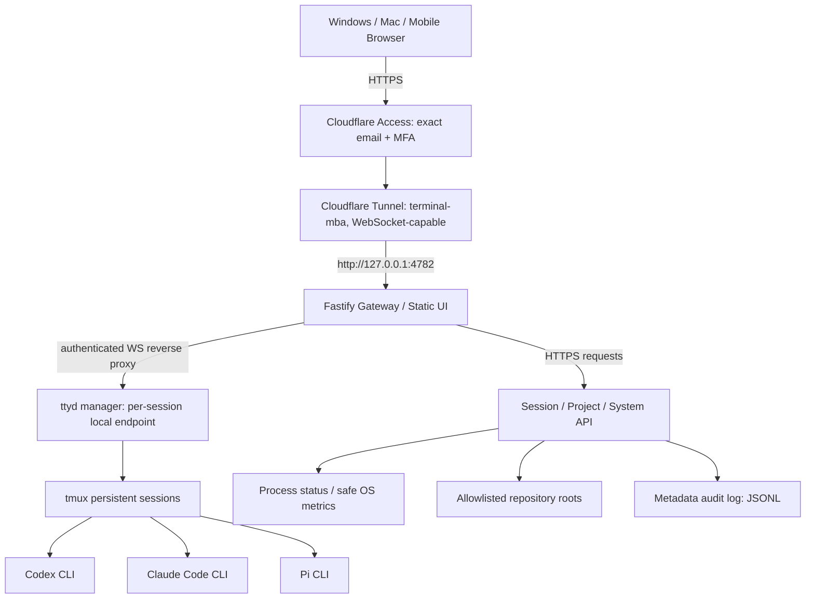

# System Architecture

> Status: design proposal only; not deployed. Public repository / private runtime.

Trust boundaries: external Cloudflare Access, origin JWT verification, session authorization,
loopback-only ttyd, tmux processes, and macOS user permissions. Project-root allowlisting is not OS sandboxing.
See [API](API-CONTRACT.md) and [Security](SECURITY.md).

## 2. Decisions and tradeoffs

| Decision | MVP choice | Why |
|---|---|---|
| Hosting | Native macOS, LaunchAgent | CLI accounts, Keychain, repo filesystem stay local; avoid Docker Desktop overhead |
| Public entry | `terminal.yapweijun1996.com` only | One protected origin for UI/API/WebSocket |
| Transport | Dedicated Cloudflare Tunnel *on MacBook Air* | Mac mini's `localhost` is not MacBook Air's localhost; independent failure domain |
| Identity | Cloudflare Access allowlist of one exact email; enforced MFA through compatible IdP preferred | Fail closed before the origin; email-only OTP is not equivalent to strong MFA |
| Frontend | React + TypeScript + Vite (static build) | Maintainable, small production SPA |
| HTTP API | Fastify on `127.0.0.1:4782` | Same-origin APIs, policy enforcement, observability |
| Terminal bridge | `ttyd` behind authenticated gateway, loopback or permission-restricted UNIX socket | Mature WebSocket PTY, lighter than rebuilding terminal plumbing |
| Session persistence | `tmux` | Survives browser disconnect; does not survive host restart by default |
| Storage | User-owned JSON config + append-only JSONL audit/events | No DB server for single-user MVP; migrate to SQLite when concurrent metadata needs increase |
| Process startup | macOS `launchd` LaunchAgent | Login-time auto-start; test crash recovery and clean shutdown |
| CLI model | Interactive `codex`, `claude`, `pi` | Reuses supported native CLI auth and approvals; do not impersonate APIs |
| Auth execution | Existing user initially, **prefer dedicated unprivileged local account if practical** | Same-account CLI can access that account's data; document blast radius |

**Important:** The labels and status of agents are observational. A live tmux session does not prove the AI model is actively processing a task.

## 3. Architecture

**Trust boundaries:** Cloudflare Access is the external gate. The origin Gateway independently validates signed Access JWTs, expected issuer, audience, and allowed email for **every HTTP request and WebSocket upgrade**. `ttyd` is never Internet-routable and only the Gateway knows its session routing table. Network-level tunnel protection is not a sandbox for arbitrary shell commands.

### Requests and data flows
1. Browser navigates to the hostname; Access authenticates the owner.
2. `cloudflared` on the MacBook Air forwards authorized requests to the single loopback Fastify port.
3. Gateway validates JWT and serves SPA `/`, routes `/api/*`, and proxies `/t/<session-id>/*` including WebSocket upgrade.
4. Owner selects a registered project + agent. Gateway validates exact project ID, canonical path, allowed root and CLI binary before creating a uniquely named tmux session.
5. The session manager attaches `ttyd` to this tmux session and proxies its browser terminal path. At most one writer by default (`ttyd -m 1`); an explicit takeover flow may be added later.
6. Disconnect closes a WebSocket/ttyd client, **not** the tmux session. On reconnect, Gateway reattaches to an existing tmux session if it still exists.
7. On Mac sleep, reboot, user logout, token expiration, or network failures, show precise status rather than falsely claiming success.

### Why `ttyd` rather than `node-pty` now?
`ttyd` provides an existing xterm.js-based browser terminal, Unicode/IME support, WebSocket transport, macOS installation, and options such as writable mode `-W`, origin check `-O`, maximum clients `-m`, and proxy base path `-b`. MVP uses its built-in terminal screen inside a same-origin panel. If richer native terminal interactions become necessary, Phase 2 can replace only the bridge with xterm.js + node-pty; keep tmux and API contracts stable.

### Why a separate laptop tunnel?
The established tunnel on Mac mini operates in Mac mini's process/network namespace; a `127.0.0.1` route there cannot address MacBook Air. Use a distinct named tunnel and hostname route directly on MacBook Air. Do not attach a second Mac to the Mac mini tunnel as an accidental shared-replica setup with heterogeneous origin routes.
