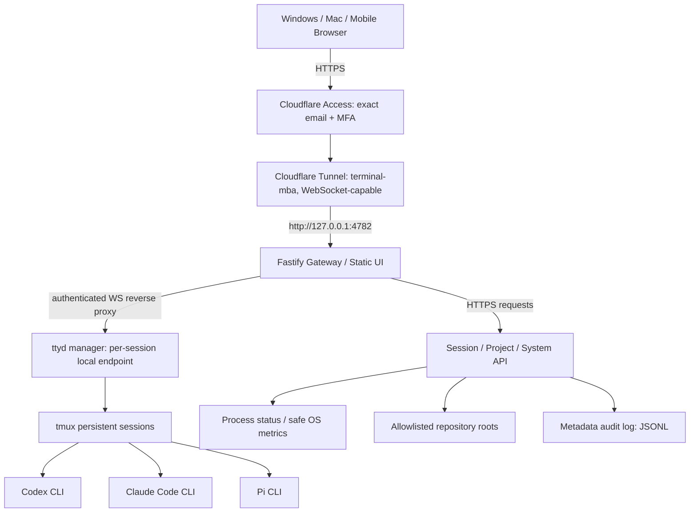

# Mac AI Terminal Hub — MVP v1.0

**Project:** `Mac-AI-Terminal-Hub`

**Hostname:** `https://terminal.yapweijun1996.com`

**Host:** MacBook Air M4 / 32GB, macOS (verify actual runtime in preflight)

**Audience:** Single owner; Windows / macOS / mobile browser

**Repository visibility:** Public source repository. Private Access-protected runtime.

**Status:** Design only. No service has been deployed or verified through this specification.

**Date:** 2026-10-08 (SGT)

## 1. Objective / 目标

Deliver a secure, low-idle-resource, browser-first control panel that connects to actual interactive Codex CLI, Claude Code CLI, and Pi CLI processes running on the MacBook Air, without requiring Codex Desktop, open inbound ports, or an always-connected browser.

### Outcomes
- Access from a standard browser at the exact hostname through Cloudflare Access.
- Launch, attach to, detach from, and terminate **named** agent sessions with a repository working directory.
- Restore live tmux sessions after browser refresh or network loss; never imply sessions survive macOS reboot.
- Show truthfully labeled Mac status, service health, and *session* status.
- Never report an agent task as *Completed* solely because a CLI window closed; reliable completion requires explicit structured evidence.
- All mutable operations are restricted to the authenticated owner and recorded as metadata-only audit events.

### Out of scope for MVP
- Exposing Mac-MCP administrative functions or privileged host operations to external callers.
- Full desktop remote control, file explorer/editor, Docker/Kubernetes management, or auto-deploying Git commits.
- Multi-user collaboration, shared terminal typing, public guest access, and agent cross-machine orchestration.
- Auto-answering CLI approval prompts, background scheduled job runners, unsandboxed automatic elevated permissions.
- Guaranteed access when MacBook Air is asleep, logged out, offline, or battery depleted.

## 2. Decisions and tradeoffs

| Decision | MVP choice | Why |
|---|---|---|
| Hosting | Native macOS, LaunchAgent | CLI accounts, Keychain, repo filesystem stay local; avoid Docker Desktop overhead |
| Public entry | `terminal.yapweijun1996.com` only | One protected origin for UI/API/WebSocket |
| Transport | Dedicated Cloudflare Tunnel *on MacBook Air* | Mac mini's `localhost` is not MacBook Air's localhost; independent failure domain |
| Identity | Cloudflare Access allowlist of one exact email; enforced MFA through compatible IdP preferred | Fail closed before the origin; email-only OTP is not equivalent to strong MFA |
| Frontend | React + TypeScript + Vite (static build) | Maintainable, small production SPA |
| HTTP API | Fastify on `127.0.0.1:4782` | Same-origin APIs, policy enforcement, observability |
| Terminal bridge | `ttyd` behind authenticated gateway, loopback or permission-restricted UNIX socket | Mature WebSocket PTY, lighter than rebuilding terminal plumbing |
| Session persistence | `tmux` | Survives browser disconnect; does not survive host restart by default |
| Storage | User-owned JSON config + append-only JSONL audit/events | No DB server for single-user MVP; migrate to SQLite when concurrent metadata needs increase |
| Process startup | macOS `launchd` LaunchAgent | Login-time auto-start; test crash recovery and clean shutdown |
| CLI model | Interactive `codex`, `claude`, `pi` | Reuses supported native CLI auth and approvals; do not impersonate APIs |
| Auth execution | Existing user initially, **prefer dedicated unprivileged local account if practical** | Same-account CLI can access that account's data; document blast radius |

**Important:** The labels and status of agents are observational. A live tmux session does not prove the AI model is actively processing a task.

## 3. Architecture



**Trust boundaries:** Cloudflare Access is the external gate. The origin Gateway independently validates signed Access JWTs, expected issuer, audience, and allowed email for **every HTTP request and WebSocket upgrade**. `ttyd` is never Internet-routable and only the Gateway knows its session routing table. Network-level tunnel protection is not a sandbox for arbitrary shell commands.

### Requests and data flows
1. Browser navigates to the hostname; Access authenticates the owner.
2. `cloudflared` on the MacBook Air forwards authorized requests to the single loopback Fastify port.
3. Gateway validates JWT and serves SPA `/`, routes `/api/*`, and proxies `/t/<session-id>/*` including WebSocket upgrade.
4. Owner selects a registered project + agent. Gateway validates exact project ID, canonical path, allowed root and CLI binary before creating a uniquely named tmux session.
5. The session manager attaches `ttyd` to this tmux session and proxies its browser terminal path. At most one writer by default (`ttyd -m 1`); an explicit takeover flow may be added later.
6. Disconnect closes a WebSocket/ttyd client, **not** the tmux session. On reconnect, Gateway reattaches to an existing tmux session if it still exists.
7. On Mac sleep, reboot, user logout, token expiration, or network failures, show precise status rather than falsely claiming success.

### Why `ttyd` rather than `node-pty` now?
`ttyd` provides an existing xterm.js-based browser terminal, Unicode/IME support, WebSocket transport, macOS installation, and options such as writable mode `-W`, origin check `-O`, maximum clients `-m`, and proxy base path `-b`. MVP uses its built-in terminal screen inside a same-origin panel. If richer native terminal interactions become necessary, Phase 2 can replace only the bridge with xterm.js + node-pty; keep tmux and API contracts stable.

### Why a separate laptop tunnel?
The established tunnel on Mac mini operates in Mac mini's process/network namespace; a `127.0.0.1` route there cannot address MacBook Air. Use a distinct named tunnel and hostname route directly on MacBook Air. Do not attach a second Mac to the Mac mini tunnel as an accidental shared-replica setup with heterogeneous origin routes.

## 4. UI/UX product specification

### 4.1 Desktop (>= 1024 px)
- **Left navigation (220 px):** Overview, Terminal, Projects, Sessions, System, Settings.
- **Topbar (56 px):** project title, host connection indicator, lock icon, profile/sign out.
- **Main terminal workspace:** horizontal tabs for Codex / Claude / Pi or custom named sessions; terminal always largest panel; resizable sidebar optional.
- **Right inspector (280 px, collapsible):** active repo and branch, current agent name/CLI version, session attached/detached, process telemetry, last reconnection.
- **Footer:** source of system status and last updated timestamp; explicit reconnect button.
- Default to dark neutral terminal area, accessible light/dark dashboard. No avatars, marketing hero images, heavy animation, or wallpaper.

### 4.2 Mobile (< 768 px)
- Use a compact topbar and 4 navigation icons at the bottom: Home, Terminal, Projects, Monitor.
- The terminal has full usable width and a sticky software key row: `Esc`, `Tab`, `Ctrl`, `Alt`, arrow keys, Paste.
- Avoid browser zoom triggered by small input font; ensure no horizontal page overflow and comfortable touch targets >=44 CSS pixels.
- Collapse project navigator into an accessible drawer and inspector into a sheet.
- Preserve terminal scrollback, focus/keyboard behavior, and text selection when switching tabs.

### 4.3 Screens

**Overview**
- MacBook Air host state: `Online`, `Offline`, `Asleep/Unreachable`, or `Unknown` (use evidence; don't infer sleep solely from unreachable).
- CPU utilization, memory pressure / estimated used memory, disk free, uptime, battery/charging status when exposed safely.
- Three tool availability tiles: Codex, Claude, Pi with `Installed / Authenticated? / Unknown` (do not infer authentication from binary presence).
- Recent sessions with `Attach` and last observed activity.

**Terminal**
- Agent tabs with project path, tab title and status: `Attached`, `Detached`, `Stopped`, `Unknown`.
- Single explicit `New Session` flow: pick project, agent, optional label, confirmation.
- Safe actions: `Reconnect`, `Detach`, `Stop session` (requires confirmation). Do **not** show a fake `AI Finished` status.
- Copy selection, paste, optional font size and theme settings; `Ctrl+C` behavior must be tested with mobile controls.

**Projects**
- Admin adds canonical local Git repo path from an allowlisted directory (no browser-supplied path executed directly).
- Show repo name, branch, dirty/clean state, last checked at, available agent launch buttons.
- Git operations MVP are read-only metadata; no automatic `pull`, `push`, `reset`, `merge` or `delete`.

**Sessions**
- Searchable list: session ID, label, agent, project, start time, last attached time, tmux alive, browser clients.
- Separate statuses for transport, tmux shell, and inferred CLI process where possible; otherwise `Unknown`.
- `Detach` does not kill the process. `Stop` explicitly terminates it. `Delete history` only clears metadata (separate action).

**System**
- Gateway, `cloudflared` and tmux process health.
- Read-only CPU/RAM/disk and process count; timed refresh, no rapid polling in the background.
- Mac-MCP health is *integration placeholder* only; add a read-only health adapter later with independent credentials.

**Settings**
- Allowed local project root(s), default agent, theme, visible aliases, audit retention, read-only security posture checks.
- For authentication management, link out to Cloudflare Zero Trust; do not recreate login passwords in this app.

### 4.4 States and empty/error UX
- Login/session expired: Cloudflare Access re-authentication + `Reconnect` after successful auth.
- Host unreachable: explain last successful contact and that CLI work may or may not still be running.
- Browser disconnected: `Detached / Connection lost`, show reconnect; do not retry `POST /sessions` or accidentally create duplicates.
- Session terminated: `Stopped`; offer create a fresh session; don't claim recoverable.
- Already attached from another browser: show read-only/in-use banner; require explicit takeover in future phase.
- Agent missing or not logged in: show a precise local-setup message; don't leak tokens or raw environment.
- Origin/Access error: generic safe message; keep sensitive stack traces in local diagnostic logs only.

## 5. Public and private interfaces

### Routes (all require validated Access identity unless explicitly noted)

| Verb / transport | Path | Purpose | Notes |
|---|---|---|---|
| `GET` | `/` and `/assets/*` | Authenticated dashboard | Never make public fallback |
| `GET` | `/api/v1/health` | Human-readable service health | Authenticated; avoid hostname/system secrets |
| `GET` | `/api/v1/system` | macOS status snapshot | Cache 5–10 seconds, safe fields only |
| `GET` | `/api/v1/agents` | Installed binary/version probe | Never expose API keys |
| `GET` | `/api/v1/projects` | Registered projects | Canonical paths only to owner |
| `POST` | `/api/v1/projects` | Register allowlisted project | CSRF + path canonicalization |
| `GET` | `/api/v1/sessions` | Query persisted metadata + live tmux state | Explicit status semantics |
| `POST` | `/api/v1/sessions` | Start project-agent session | Idempotency key; spawn without shell interpolations |
| `GET` | `/api/v1/sessions/:id` | Session detail | Opaque ID from registry, no arbitrary path |
| `POST` | `/api/v1/sessions/:id/detach` | Disconnect browser transport | Never kill tmux |
| `POST` | `/api/v1/sessions/:id/stop` | Explicitly terminate session | Confirm UI action + audit; optional graceful shutdown |
| `WS + GET` | `/t/:id/*` | Browser terminal HTTP/WS reverse proxy | Validate Access JWT and Origin at upgrade; never accept arbitrary upstream URL |

**Future, not MVP:** `/api/v1/tasks` backed by structured Codex/Pi event adapters to observe queued/running/completed/failed with proof of actual outcomes; Mac-MCP read-only health endpoint.

### Metadata schema

```ts
type Agent = 'codex' | 'claude' | 'pi';
type SessionState = 'created' | 'attached' | 'detached' | 'stopped' | 'unknown';

type Project = {
  id: string; name: string; canonicalPath: string;
  createdAt: string; lastInspectedAt?: string;
};
type HubSession = {
  id: string; label: string; agent: Agent; projectId: string;
  tmuxName: string; state: SessionState;
  createdAt: string; lastAttachedAt?: string; stoppedAt?: string;
};
type AuditEvent = {
  ts: string; action: string; actor: string;
  sessionId?: string; projectId?: string; result: 'ok' | 'denied' | 'error';
};
```

No shell keystrokes, terminal scrollback, API keys, access JWTs, or repo content in Hub audit storage by default.

## 6. Security requirements — MUST ship before public exposure

### 6.1 Identity and network
1. Cloudflare **self-hosted HTTP** Access application covers the exact entire hostname, including `/api/*`, `/t/*`, static assets and WebSocket upgrades; no Bypass rules.
2. Allow rule uses the owner's **exact email address**, not an entire domain. Prefer a Google/other compatible IdP with real MFA. Email OTP can be a fallback but should not be presented as phishing-resistant MFA.
3. Keep Access session duration short (proposal: 4–8 hours) and require reauthentication for sensitive workflows as needed. Expiry of Access session does not inherently kill a previously established tmux process.
4. Run `cloudflared` locally on the MacBook Air with a **dedicated Tunnel**, egress-only; no inbound router port forwarding.
5. App binds `127.0.0.1:4782` only. `ttyd` binds a loopback address or restricted UNIX socket; never `0.0.0.0` or raw public port.
6. Reject unexpected `Host` values and ensure only the trusted reverse proxy can reach ttyd. Do not publish ttyd ports as additional Cloudflare routes.

### 6.2 Origin defense-in-depth
7. Gateway validates `Cf-Access-Jwt-Assertion` signature against Cloudflare JWKS, expected issuer and app audience, expiration, token type, and exact email; use `jose` or equivalent mature library, not decode-only validation. Fail closed if keys unavailable with no valid cache.
8. Validate on **every HTTP route and WebSocket upgrade**, not only page loads. Do not use a client-controlled `email` HTTP header as proof of identity.
9. For state-changing HTTP: Origin/Referer checks, CSRF token, content-type enforcement, body-size limits, per-user rate limits, and idempotency for `POST /sessions`. No `GET` side effects.
10. For WebSocket: enforce exact expected `Origin`, validate Access token at upgrade, reject non-allowlisted session IDs, set 1 writer/session, heartbeat and bounded buffers/scrollback. Recheck authorizations at reconnection. Enforce a bounded WebSocket connection lifetime aligned with security policy (on expiry, disconnect the *browser socket* but never silently kill the tmux process). Close live sockets promptly on explicit owner revocation where practical.
11. Security headers: CSP, HSTS at Cloudflare edge, `X-Content-Type-Options: nosniff`, restrictive `Permissions-Policy`; main dashboard `frame-ancestors 'none'`; same-origin embedded ttyd path can use `frame-ancestors 'self'` where needed. Never use permissive global `*` CSP to make terminal work.

### 6.3 Host command and file safety
12. Never run Gateway, ttyd, agents as `root` or administrator unless explicitly justified; prefer a dedicated **standard macOS user** and narrow project directory permissions.
13. Registered project directories are allowlisted. Resolve `realpath`/symlinks and verify path containment before launching. Refuse paths outside approved roots and symlink escapes.
14. Select CLI by fixed enum (`codex`, `claude`, `pi`), resolve trusted absolute binary paths, spawn without `sh -c` or concatenated untrusted arguments. Disable ttyd `--url-arg`.
15. Web terminal shell still grants the underlying local user's permissions! An allowlisted **launcher is not a filesystem sandbox**. If strict isolation is required, use a separate macOS user/account and permissions, or a suitably controlled VM/container strategy.
16. Default to interactive approval modes supported by each CLI. Never auto-approve destructive operations, full-access/sandbox bypass, `sudo`, credentials export, or production deployment.
17. Pin and audit npm/brew dependencies. Treat untrusted repositories/agent instructions and Pi extensions as executable attack surfaces; do not blindly install packages or auto-run post-install hooks.

### 6.4 Confidentiality, audit, operations
18. CLI credentials remain in the local CLI provider/OS-managed locations. No credential syncing to browser JS, logs, environment inspection API, or the Hub Git repo.
19. Audit **metadata only**: sign-in policy failures if available, session create/attach/detach/stop, project registration, admin actions. No keystroke or output recording by default. Suggested local retention 30 days.
20. Protect local files and tunnel credentials with file permissions; exclude `.env`, credential caches, data/ and logs/ from Git. Restrict local network users as appropriate.
21. This **source repository is public**. Never commit credentials, real `.env` values, tokens, local inventories, CLI login stores or logs. Review public PRs for sensitive data and require tests and human approval.
22. Build a one-command `stop`/rollback path; back up project registry/configuration but never copy authentication tokens into backups.

## 7. Repository structure

```text
Mac-AI-Terminal-Hub/
├── README.md
├── docs/
│   ├── PRD.md
│   ├── ARCHITECTURE.md
│   ├── SECURITY.md
│   ├── DEPLOY-MACOS.md
│   ├── OPERATIONS.md
│   └── TEST-PLAN.md
├── apps/
│   ├── web/                         # React + Vite + TypeScript
│   │   ├── src/
│   │   │   ├── app/
│   │   │   ├── components/{layout,terminal,metrics,projects,sessions}/
│   │   │   ├── pages/{Overview,Terminal,Projects,Sessions,System,Settings}/
│   │   │   ├── api/
│   │   │   └── styles/
│   │   ├── index.html
│   │   └── package.json
│   └── gateway/                     # Fastify server (loopback only)
│       ├── src/
│       │   ├── server.ts
│       │   ├── auth/{access-jwt,csrf,origin}.ts
│       │   ├── routes/{system,agents,projects,sessions}.ts
│       │   ├── sessions/{manager,tmux,ttyd,registry}.ts
│       │   ├── projects/{allowlist,git-inspect}.ts
│       │   ├── system/{metrics,health}.ts
│       │   ├── audit/{events,redaction}.ts
│       │   └── config/
│       └── package.json
├── packages/
│   └── shared/                      # API types + runtime schemas
├── config/
│   ├── projects.example.json
│   └── terminalhub.example.env     # no real secrets
├── deploy/
│   ├── macos/
│   │   ├── com.yapweijun.terminalhub.plist.template
│   │   ├── com.yapweijun.terminalhub-tunnel.plist.template
│   │   ├── install.sh
│   │   ├── uninstall.sh
│   │   └── diagnostics.sh
│   └── cloudflare/
│       └── README.md               # route + Access policy manual checklist
├── scripts/
│   ├── preflight.sh
│   ├── dev.sh
│   ├── build.sh
│   ├── rollback.sh
│   └── validate-origin.sh
├── tests/
│   ├── unit/
│   ├── integration/
│   ├── security/
│   └── e2e/
├── .github/workflows/{ci.yml,dependency-audit.yml}
├── .gitignore
├── package.json
└── pnpm-workspace.yaml
```

### Recommended environment template

```dotenv
HUB_HOST=127.0.0.1
HUB_PORT=4782
PUBLIC_HOSTNAME=terminal.yapweijun1996.com
CF_ACCESS_TEAM_DOMAIN=https://YOUR-TEAM.cloudflareaccess.com
CF_ACCESS_AUD=REPLACE_WITH_APP_AUDIENCE
CF_ACCESS_ALLOWED_EMAIL=REPLACE_WITH_OWNER_EMAIL
PROJECT_ROOTS=/Users/YOUR_LOCAL_USER/Projects
AUDIT_RETENTION_DAYS=30
TTYD_BIN=/opt/homebrew/bin/ttyd
TMUX_BIN=/opt/homebrew/bin/tmux
CODEX_BIN=REPLACE_WITH_VERIFIED_ABSOLUTE_PATH
CLAUDE_BIN=REPLACE_WITH_VERIFIED_ABSOLUTE_PATH
PI_BIN=REPLACE_WITH_VERIFIED_ABSOLUTE_PATH
```

Never commit a populated `.env`, credential file, Cloudflare Tunnel token, or CLI auth store.

## 8. Implementation plan and gate tests

| Phase | Work | Exit gate |
|---|---|---|
| **P0 — preflight** | Verify CLI binary paths + versions/login state, tmux/ttyd availability, host power/sleep behavior, Git repositories, user context and folder ownership; decide single-user vs dedicated macOS account | Report what is known/unknown; no changes to Mac mini routes |
| **P1 — protected connectivity** | Prepare public source repository, SPA/gateway, MacBook Air dedicated tunnel, exact hostname DNS, Cloudflare Access owner allowlist/MFA/JWT validation | Unauthenticated external HTTP + WS **denied**; signed valid browser access works; ports loopback only |
| **P2 — core terminal** | Build tmux registry, ttyd manager, same-origin path proxy, 3 agents, project launcher, reconnect | CLI commands really run; reconnect attaches same `tmux` session; second writer rejected; session stop requires confirmation |
| **P3 — dashboard** | Overview, Project list, Session list, system metrics, mobile controls, settings | 390x844 and 430x932 no horizontal scrolling; actual Mac metrics are labeled/accurate; no false agent-completion statuses |
| **P4 — hardening & ops** | Metadata audit, CSRF, rate limiting, WebSocket Origin checks, launchd login startup, runbooks, failure injection and dependency review | Security tests pass, unattended tunnel reconnection when host awake, graceful rollback tested |
| **P5 — optional integrations** | Mac-MCP read-only health, CLI event hooks, notifications, task outcomes, Git diff view | Separate change proposal + threat review; not needed for MVP production gate |

### Acceptance suite: minimum
- [ ] `https://terminal.yapweijun1996.com` shows Access sign-in to an unauthenticated browser; no SPA data leaks.
- [ ] Unauthenticated `/api/v1/system`, `/api/v1/sessions`, `/t/...` requests fail closed.
- [ ] WebSocket upgrade without valid Access token/expected Origin fails closed.
- [ ] Owner authenticates via MFA-capable IdP; another email is denied even if email domain is shared.
- [ ] Gateway/ttyd are not accessible on any LAN/public interface.
- [ ] Codex/Claude/Pi are verified locally; missing agent yields an explicit error, not success.
- [ ] Creating a session with path traversal, symlink escape, or unknown binary is rejected.
- [ ] One project+agent creates one named tmux session; browser refresh reattaches to same ID.
- [ ] Network disconnect does not kill tmux; manual Stop does and creates an audit event.
- [ ] Race: double-click or retried create request does not duplicate a session (idempotency key).
- [ ] Terminal handles Mandarin IME, UTF-8, paste, resize, mobile key input and basic copy.
- [ ] Mobile 390x844 / 430x932 visual QA; desktop 1440px; no horizontal document overflow.
- [ ] System fields are genuine host observations; unavailable metrics show `Unknown`.
- [ ] App and tunnel recover after process crash; on macOS login they restart via launchd.
- [ ] Laptop lid-close, wake, logout, reboot, power loss tests document expected outages; no guarantee of 24/7 access.
- [ ] Git ignores secrets, tunnel tokens, local user configuration, runtime data, logs.
- [ ] Security headers, CSRF, Access JWT validation, Origin validation, dependency audit and no root process are verified.
- [ ] Rollback command stops tunnel and Hub without losing registered project information.

## 9. Failure modes & mitigations

| Event | User impact | Expected behavior |
|---|---|---|
| Browser refresh / transient Wi-Fi break | Terminal disconnect | Reconnect to same tmux ID after auth; no new session |
| Cloudflare Access expired | HTTP/WS unauthorized | Login again; tmux stays alive if Mac awake |
| Mac lid closed/sleep | Tunnel often unreachable | Show `Unreachable`; do not claim work still running; user wakes Mac |
| `cloudflared` crashes | Host unreachable | LaunchAgent restarts tunnel, check actual public URL, not stale tunnel-list signal |
| Gateway crashes | Dashboard unavailable | LaunchAgent restarts gateway; tmux typically survives |
| `ttyd` crashes | Terminal iframe disconnect | Recreate ttyd bridge, reattach tmux |
| `tmux` server exits | CLI session lost | Mark stopped/unknown; don't claim recoverable |
| Mac logs out/reboots | User processes or tmux die | Relaunch services upon next user login; tmux sessions not restored automatically |
| Unauthorized Access email | No application access | Deny; audit at Cloudflare, no origin access |
| WebSocket cross-origin attempted | Potential drive-by command injection | Deny before upgrade |
| Untrusted repo instruction requests credential access | Host data theft risk | Require user approval; restrict CLI OS account and project permissions |

## 10. Rollout and rollback

- Develop locally at `http://127.0.0.1:4782`; do not map the domain until Access and origin verification are in place.
- Create the Access self-hosted application with exact hostname + policy **before** publishing the final route; test from a separate unauthenticated browser.
- Install distinct tunnel from MacBook Air to Gateway. Use `launchd` for login-time startup and crash restart; report that logout/host sleep still interrupt service.
- Release `v0.1.0` only after P1–P4 gates. Keep a previous tagged build and current LaunchAgent template for rollback.
- To roll back, stop the gateway/tunnel LaunchAgents and/or disable Cloudflare hostname route; existing files remain. Preserve agent sessions only where safe and possible.

## 11. Task delegation brief (copy to local Codex CLI when ready)

> Build Mac-AI-Terminal-Hub per this spec. First perform read-only P0 preflight, report host paths/versions/security gaps, and do not change the existing Mac mini tunnel. Implement P1–P4 on a feature branch with incremental commits (public repo branches are public). No credential copying, no public anonymous terminals, no root execution, no bypassing Cloudflare Access, no `sh -c` on user-controlled input. Require test evidence for HTTP & WS authorization, reconnect, one-writer sessions, path traversal, mobile QA, and rollback. Do not deploy to the public hostname without explicit owner approval after the security gate.

## 12. Authoritative references (reviewed 2026-10-08)

- Cloudflare published application routes: https://developers.cloudflare.com/cloudflare-one/networks/connectors/cloudflare-tunnel/routing-to-tunnel/
- Cloudflare self-hosted applications: https://developers.cloudflare.com/cloudflare-one/access-controls/applications/http-apps/
- Cloudflare Tunnel WebSocket support: https://developers.cloudflare.com/cloudflare-one/faq/cloudflare-tunnels-faq/
- Cloudflare Access JWT verification: https://developers.cloudflare.com/cloudflare-one/access-controls/applications/http-apps/authorization-cookie/validating-json/
- Cloudflare Access MFA: https://developers.cloudflare.com/cloudflare-one/access-controls/policies/mfa-requirements/
- ttyd README/flags: https://github.com/tsl0922/ttyd
- tmux persistent sessions: https://github.com/tmux/tmux/wiki/Getting-Started
- Codex CLI: https://github.com/openai/codex
- Claude Code: https://support.claude.com/en/articles/14554922-claude-code-user-faq
- Pi coding agent: https://github.com/badlogic/pi-mono
- macOS laptop sleep: https://support.apple.com/en-sg/guide/mac-help/mh10330/mac